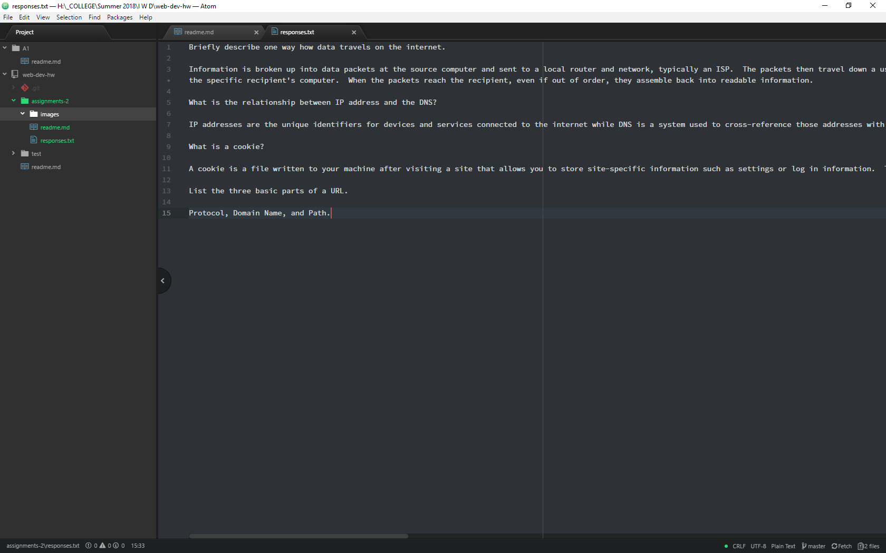

# Assignment 2

A Version Control System is allows for the management of files for a specific project by tracking changes, organizing and reconciling edits, and streamlining development.  We are using one so we can see the incremental changes we make and quickly go back to previous versions if they break.  We also use it to have a central repository of assignments with standard tools in the form of GIT.  Lastly, They will teach us good working habits as VCS and GIT in particular are industry standards.

My [respones to Assignment 2](./responses.txt).

For my work cycle I went step by step through the list on the moodle assignment page, doing each in turn.  I used the Windows Snipping Tool for my screenshots but ran into a small problem with Atom as a text editor.  It was removing spaces in my responses.txt file.  I circumvented the problem by using Notepad to finish the file.  I later went back and saw that Atom's Soft Wrap was disabled by default and have since turned it on.  I then published everything to Github.

