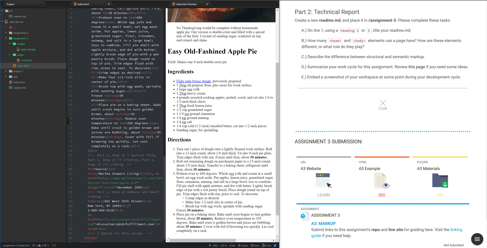

# Assignment 3 Readme

* A page can have only one `<head>` and one `<body>` elements each.  The `<head>` element is used to contain information about the page and can contain tags used by browsers to aid in displaying the page.  It is typically invisible to visitors, but can contain visible elements such as the `<title>` tag.  The `<body>` element is used to contain all the contents actually visible to a site's visitors including text, images, and other media.

* Structural markup uses tags that change the actual appearance of content on the page such as positioning and whether or not something is in a heading or a paragraph.  By contrast, semantic markup uses tags that differentiate the content through formatting and declares things like quotes, citations, and different emphasis styles.

* I simply worked through the moodle steps one at a time, referencing the text when needed. I didn't encounter any real hiccups with the assignment as both the instructional site and textbook were very clear.  I used the provided crust.html file to ensure the sites were uniform in style, though i did choose to add more emphasis on certain times and temperatures in the main recipe.

 
