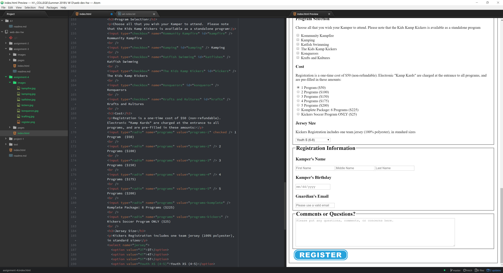

# Assignment 4 Readme

* Alt text is used by screen readers in place of an image and, as such, is to be descriptive of the image and as detailed as necessary.  It is also used with the title attribute if a browser is unable to load the image.

* The web is filled with sign-in pages and user account update pages and has had them almost from its inception.  I find captchas to be the most interesting.  These are challenge-response systems that are supposed to filter out automated field entries from human entries.  The technology is in a constant arms race with bot programmers with more convoluted forms and fields being used to thwart them.

* I bounced around a bit more with this assignment, breaking it into categories based on complexity and working from easiest to most difficult.  I made the table a bit more challenging by trying to optimize it.  I had to choose between formatting the table as a time-by-day or day-by-event and tried variations.  In the end, I went with the chosen table since it was five lines of code less than the other option.  I am intrigued by the `style` portion of the header and plan to tuck into it more.

 
