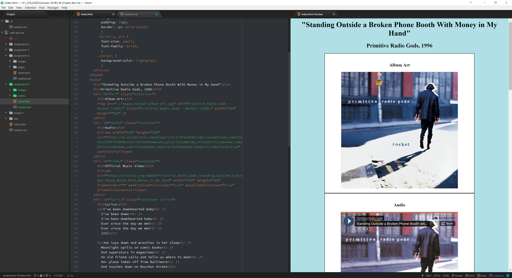

# Assignment 5 Readme

* Divs are used to define blocks of a webpage to better construct the page.  They lack styling except to trigger the start of a new line.  Spans work like divs but on an inline basis, allowing better organization.  Class and ID allow elements to be indentified.  ID uses unique values while class can identify multiple elements with the same value.  Used in combination with div and span, id and class can be used for styling different sections of the page.

* A third-party media host allows for increased uptime due to server redundancies.  Many are also of lower cost providing increased bandwidth and storage space.  Most also handle file conversions for the purposes of compatability with various browsers.  Content protections is also available through a few hosts, actively protecting your media.

* Proceeded down the list as normal.  Ran into a bit of a hitch trying to embed the soundcloud file, but looking at how their embeds work allowed me to reverse-engineer a workable solution.  I was also pleasently surprised to find the official video in an acceptable quality at archive.org and chose to use it over a Vimeo or Youtube.  While working on this project I began wondering what kind of copyright protection might be implemented in the `video` and `audio` elements in the future.

 
