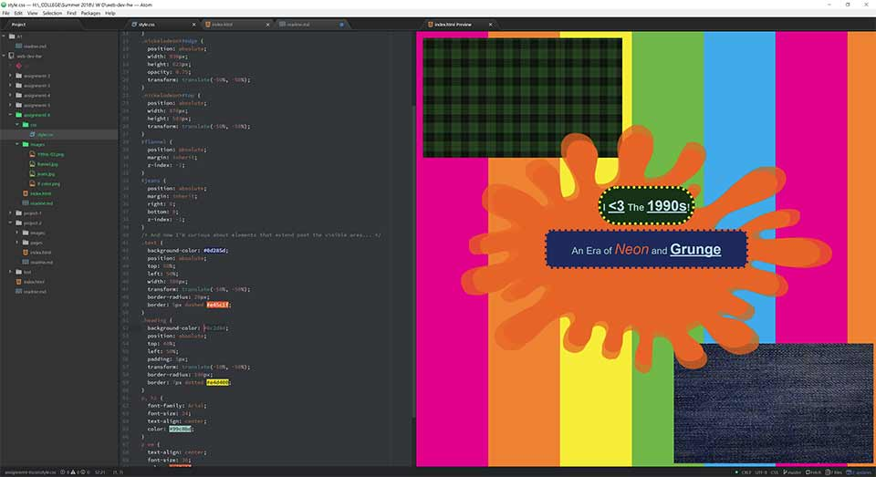

# Assignment 6 Readme

* I dipped into some old fashion articles and also thought about what I and my friends wore growing up.  I also recalled old TV shows and did some Image Search diving.  For graphic elements, I remembered the late 90s early internet and tried to emulate the design (or lack of design?) elements of the web.  The repeating background, the "fake movie marquee" stylings, and the love of underlined text all contributed.  I also like how everything reacts when the window is resized, but I am easily amused.
* `#0d285d` for blue jeans which were overly prevelant in the era.  I matched the Nickelodeon Orange with `#e45c1f`.  Lastly I chose `#0c2d0d` for my flannel color since it clashed with the others which was key to the mentality of the skater/grunge culture of the 1990s.
* This one was a little more fiddly since I really wanted to get my head wrapped around CSS positioning.  This was also the first project where I actually ran into a display difference between Atom's preview and Firefox 60.0.2.  I also toned down my ambitions with this assignment, which helped reduce my usual project-related stress.

