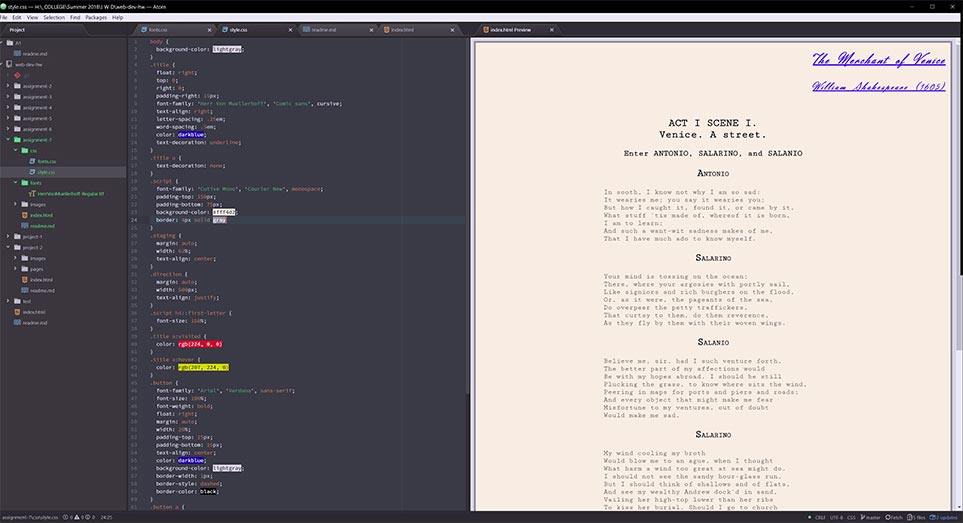

# Assignment 7 Readme
* I saw the script and decided to make it look like a screen play.  I choose Cutive Mono for the body text since it is a nice, soft, monotype font.  I feel it replicates the feel of an old typewriter.  I chose Herr Von Muellerhoff for the "handwriting" portion at the top of the page since it has nice readability with a little spacing work.  Lastly, I used good old Arial for the button.
* System fonts are fonts that are installed to the users computer, usually by the OS.  Web fonts are hosted on the servers you visit and are called up as needed.  Web-safe fonts are with system fonts (or font families) that every computer should have, regardless manufacturer.  Fallback fonts alow you to cascade to a similar font if the user can't access your specified fonts.  They allow visitors to your site to still read the contents.
* This was a pretty fast project, but I did find some apparent quirks with pseudo selectors and their CSS order.  I eventually hammered these out to my satisfaction.  This was pretty fun, to be honest.

