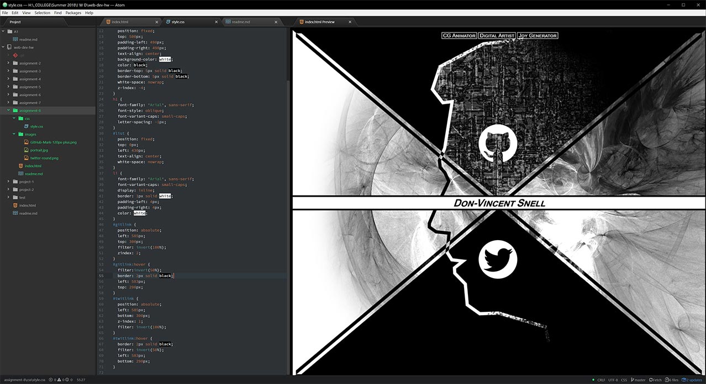

# Assignment 8 Readme
* Padding is the space from the content to the border.  The border setting is the outer edge of the element and has styling options like color. Margin is the space from the border pushed outward all the way up to and sometimes beyond other elements.
* ~~I had some difficulty getting the hover with borders to work because they were shifting since the image's dimensions would change when the border was active.  It just required a bit of fine tuning to get it to look right, but I think I accomplished what I wanted.~~  Right, so I think I had a bad twitter icon.  I couldn't use the provided one even when saving the file out as a gif or pngs.  I even edited the HTML a few times.  It just wouldn't take.  Manual uploads didn't work either.  So I went and nabbed one of Twitter's brand packages and made it match in Photoshop.  And we're all good now.
* After setting up my elements in HTML I put a 1 pixel red border around everything and that gave me a much better visualization for what I was trying to do.  I then worked on each element individually thinking of it as a layer stack in photoshop.  I wouldn't move on until I had an element exactly where I wanted it.  I think I learned a lot in this particular lesson that had been stumping me in the previous ones, so it felt very refreshing.

