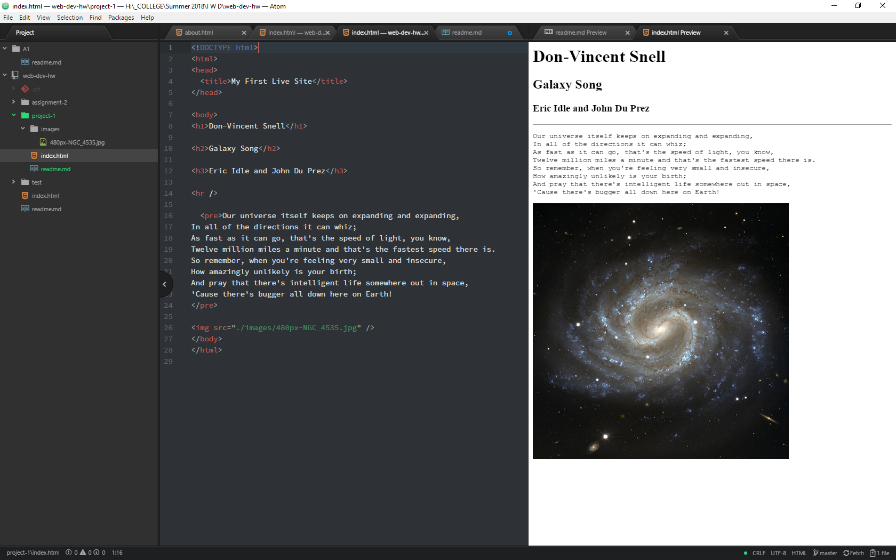

# Project 1 Readme

Browsers:
I primarily use Firefox on my PC and Chrome on my mobile devices.  On my PC, I also have Edge if (for some ungodly reason) I need to use flash.  My mobile devices also have both Firefox Mobile and Puffin for legacy reasons.

A browser takes the code in an html file and parses it into a readable page.  It pulls and organizes data within the html file from a live site for content, styling, and media and allows the user to interact with all three to varying degrees.

I've used the Wayback Machine several times for both fun and profit. I decided to check out a site near and dear to my nostalgia.  zone.com was/is Microsoft's home for games.  Most of the earliest snapshots just tell me to upgrade to Internet Explorer but [I got one](https://web.archive.org/web/19991012170213/http://zone.com:80/default.asp) from October of 1999 that sparked all kinds of memories.  I played so much Jedi Knight on that site.  The design is very retro by today's standards.  The tiled background would not have been visible on the 16 inch 640x480 monitor I used to originally visit the site, but it is clearly there on my 4k.  The colors are also passable, but not exactly making you want to stay.  Compared to [the modern page](http://zone.msn.com/en-us/home) the purpose has stayed the same, but the newer design is more content heavy.  Larger, moving images and more categories across a wider display area is one of the big changes.  The color scheme is also more pleasing from the design angle.

Work Cycle

* I worked my way through the site and moodle at the same time, making steady progress.
* Ran into an interesting quirk with Atom where if you have HTML preview on and go to a markdown file, viewing the HTML Preview gives it the color theme of Atom.  This was not a show-stopper as the site was already published and, after toggling both previews, the HTML Preview returned to normal.
* I did some interesting research on the ` ` vs ` ` debate and found it's mostly an issue of XHTML compatability and personal preference.
* I spent way too much time getting all nostalgic with the Wayback Machine.
* I had forgotten how easy HTML is to code.

Project 1 Workspace:

