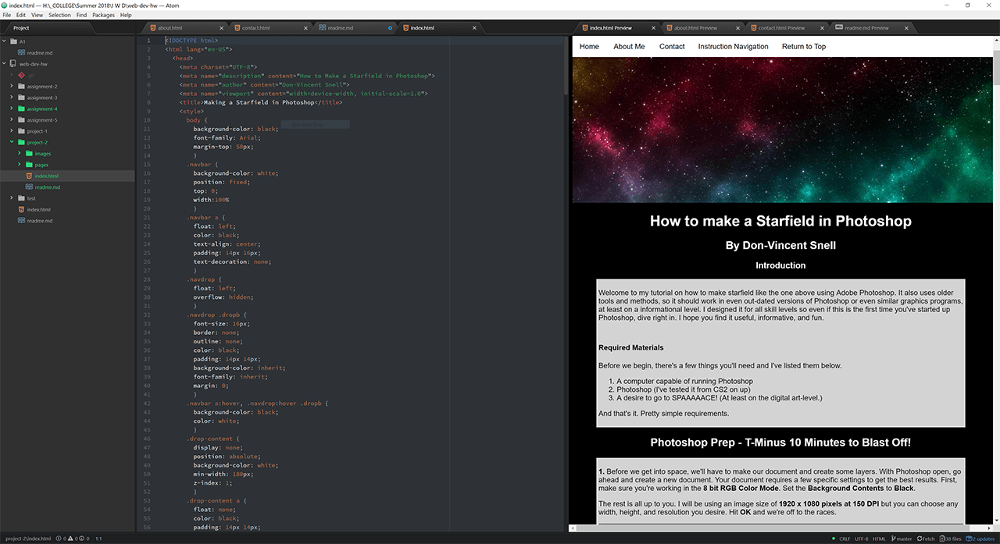

# Project 2 Readme
* I spent a lot of time looking into the more nteractive elements that can be done in HTML with a dash of CSS.  I find it interesting that so much of what could only be done in Java or in Flash a few years ago can be replicated in the basic markup languages.  Most of it was new and it was just knocking the (very heavy) cobwebs off.
* I'm looking forward to having more control over element placement with CSS.  I know I can condense webpages since half the work is layout design.
* This project was quite fun as I spent more time investigating specific code examples to achieve the look I wanted.  I may have spent more time than I should have, to be honest.  Most of the project was straight-forward, but I did run into a hitch with an errant `overflow: hidden;` style setting that I chased for a very long time.  I also continue to be surprised at how long it takes to actually break down and explain something I do purely through muscle memory at this point.  Overall, I think I learned the most from this project so far.

* My Workspace Screenshot:

